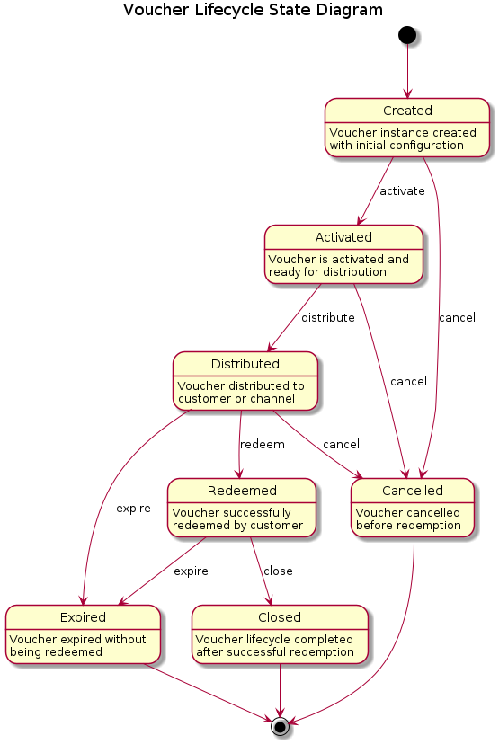

# TM Forum Inception Document
## Voucher Management API

### Executive Summary

The purpose of this API is to provide a standardized interface for managing vouchers within telecommunications service provider environments, enabling the creation, distribution, redemption, and lifecycle management of digital vouchers for prepaid services, promotional offers, and customer rewards programs. This API facilitates the seamless integration of voucher management capabilities across different systems and business processes within the telecommunications ecosystem.

In the business context of telecommunications, key terms are defined as follows:
- **Voucher**: A digital token representing a predefined value or service benefit that can be redeemed by customers for telecommunications services, top-ups, or promotional offers
- **Voucher Pool**: A collection of vouchers with similar characteristics, managed as a group for distribution and tracking purposes
- **Redemption**: The process by which a customer or system consumes a voucher to obtain its associated value or service benefit
- **Voucher Lifecycle**: The complete process from voucher creation through distribution, activation, redemption, and eventual expiration or cancellation

## 1. Introduction and Business Benefits

### 1.1. API Description

The Voucher Management API provides comprehensive functionality for telecommunications service providers to manage digital vouchers throughout their complete lifecycle. This API enables service providers to create voucher campaigns, manage voucher pools, track distribution channels, monitor redemption patterns, and analyze voucher performance metrics.

Key capabilities include:
- Voucher creation and configuration with flexible value types (monetary, service units, promotional benefits)
- Batch voucher generation for large-scale campaigns
- Multi-channel distribution management (SMS, email, mobile apps, retail partners)
- Real-time voucher validation and redemption processing
- Comprehensive tracking and reporting capabilities
- Integration with billing systems and customer management platforms
- Support for various voucher types including top-up vouchers, promotional vouchers, loyalty rewards, and service-specific vouchers

### 1.2. Expected Scenario/Use Case

In the telecommunications industry context, this API would support several critical business scenarios:

**Prepaid Top-up Management**: Mobile network operators can generate and distribute top-up vouchers through various channels including retail partners, online platforms, and direct customer communications. Customers redeem these vouchers to add credit to their prepaid accounts.

**Promotional Campaigns**: Service providers can create targeted promotional vouchers offering free data, minutes, or special service rates. These vouchers can be distributed through marketing campaigns and redeemed by customers to activate promotional offers.

**Customer Retention Programs**: Telecom operators can issue vouchers as part of customer loyalty programs, providing rewards for long-term customers or compensation for service issues. These vouchers can offer account credits, service upgrades, or exclusive access to new features.

**Partner Channel Management**: The API enables management of voucher distribution through retail partners, allowing third-party vendors to sell prepaid vouchers while maintaining centralized control and real-time inventory management.

**Corporate and Bulk Services**: Enterprise customers can purchase voucher pools for employee benefits or customer incentive programs, with the API providing administrative controls for bulk voucher management and usage tracking.

### 1.3. Other Business Benefits

#### 1.3.1 What is the primary information model entity

The primary information model entity aligns with the **Financial Account** domain from the TM Forum Information Model (GB922) R24.5, specifically as a specialized form of **Stored Value Account** or **Digital Asset**.

This positioning resolves the conceptual relationship with TMF670 Payment Method API by recognizing that vouchers are fundamentally **digital value instruments** rather than traditional product offerings:

Within the GB922 framework, the Voucher Management API primarily relates to:
- **Financial Account**: Vouchers represent stored value accounts with specific redemption rules and constraints
- **Digital Asset**: Each voucher is a digital asset with monetary or service value that can be transferred and redeemed
- **Payment Instrument**: Vouchers function as payment instruments that can be applied against billing accounts
- **Balance Management**: Voucher values integrate with account balance and credit management systems

**Clarification of Voucher vs Product Offering Relationship**:
- **Voucher Creation Services**: The *service* of creating and managing vouchers may be offered as a Product Offering to business customers (e.g., enterprise voucher programs)
- **Vouchers Themselves**: Individual vouchers are digital value instruments (financial assets) that serve as payment methods, not products to be sold to end customers
- **Voucher Distribution**: The mechanism for distributing vouchers (physical cards, digital codes) may involve Product Offerings, but the voucher value itself remains a financial instrument

This approach aligns vouchers with their natural role as payment instruments in TMF670 while providing comprehensive lifecycle management capabilities.

#### 1.3.2 What is the Primary Business Process

This API primarily supports the **Product Lifecycle Management** process from the TM Forum Business Process Framework R24.5, specifically within the following process areas:

- **1.1.4 Develop Product Offering**: Voucher creation and configuration processes
- **1.2.1 Product Portfolio Planning**: Strategic voucher campaign planning and portfolio management
- **1.3.4 Launch Product Offering**: Voucher campaign activation and market introduction
- **1.4.1 Product Performance Assessment**: Voucher redemption analytics and campaign effectiveness measurement

Additionally, the API integrates with:
- **Customer Lifecycle Management** processes for customer-specific voucher distribution and loyalty programs
- **Revenue Management** processes for voucher-based revenue recognition and financial tracking
- **Partner Lifecycle Management** processes for third-party voucher distribution channel management

### 1.4 Collateral Impact

#### 1.4.1 Do you think this API proposal supersedes, extends or overlaps with any existing TM Forum Open-API specifications

This API proposal **extends** existing TM Forum Open-API specifications rather than superseding them. Key relationships include:

**Extends**:
- **TMF654 Prepay Balance Management API**: Vouchers represent specialized stored value accounts that extend prepaid balance management capabilities
- **TMF666 Account Management API**: Voucher accounts extend general account management with specific redemption rules and constraints
- **TMF670 Payment Method API**: Provides the payment instrument management that TMF670 references during transactions

**Integrates with**:
- **TMF632 Party Management API**: For customer and partner identification in voucher transactions
- **TMF635 Usage Management API**: For tracking voucher usage and consumption patterns
- **TMF678 Customer Bill Management API**: For voucher redemption impact on customer billing
- **TMF620 Product Catalog Management API**: For voucher creation services offered to business customers
- **TMF622 Product Ordering API**: For ordering voucher creation and management services

**Potential Overlap**:
- **TMF654 Prepay Balance Management API**: Direct overlap in stored value management, requiring coordination to avoid duplication
- **TMF666 Account Management API**: Overlap in financial account operations, requiring careful interface design

#### 1.4.1.1 Integration with TMF670 Payment Method API

The relationship between the Voucher Management API and TMF670 Payment Method API is now conceptually aligned, with vouchers functioning as specialized **digital payment instruments**:

**Conceptual Alignment**:
- **No Conflict**: Vouchers are consistently treated as payment instruments/financial assets, not as product offerings
- **TMF670 Payment Method API**: Handles vouchers as payment methods during transaction processing
- **Voucher Management API**: Provides comprehensive lifecycle management for these digital payment instruments

**Architectural Relationship**:
- **Voucher Management API**: Creates, distributes, and manages digital value instruments (vouchers) throughout their lifecycle
- **TMF670 Payment Method API**: Utilizes these vouchers as payment methods during customer transactions
- **Unified Model**: Vouchers exist as digital financial assets that can be applied as payment instruments

**Integration Strategy**:
- Voucher Management API manages the financial asset lifecycle (creation, activation, distribution, expiration)
- TMF670 references voucher assets when customers select them as payment methods
- Real-time integration ensures voucher availability, balance verification, and redemption processing
- Voucher Management API updates voucher status and remaining balances after TMF670 transaction processing

**Data Flow Integration**:
1. Voucher Management API creates digital value instruments with unique identifiers and stored values
2. Vouchers are distributed to customers through various channels (managed by Voucher Management API)
3. During checkout/payment, customers select vouchers as payment methods (handled by TMF670)
4. TMF670 validates voucher availability and applies value against transaction amounts
5. TMF670 notifies Voucher Management API of redemption to update voucher status and remaining balance
6. Voucher Management API maintains complete audit trail and lifecycle history

This approach eliminates the conceptual conflict by consistently treating vouchers as digital payment instruments rather than as products to be sold.

#### 1.4.2 Do you think it causes existing service dependencies to change

Yes, implementing this API will require updates to existing service dependencies:

**Billing Systems Integration**: Existing billing systems will need to accommodate voucher redemption transactions and integrate with voucher validation processes. This may require updates to rating engines and balance management systems.

**Customer Management Systems**: CRM systems will need to integrate voucher history and redemption tracking into customer profiles and interaction histories.

**Channel Management Systems**: Retail partner systems and customer-facing applications will need to integrate voucher distribution and redemption capabilities.

**Fraud Management Systems**: Security and fraud detection systems will need to incorporate voucher-specific monitoring and validation rules.

#### 1.4.3 Are there any open JIRA issues related to this API in the TM Forum JIRA Database

Based on typical TM Forum development patterns, relevant JIRA issues might include:
- Enhancement requests for prepaid balance management improvements
- Issues related to promotional campaign management capabilities
- Requests for standardized voucher and loyalty program APIs
- Integration challenges between product catalog and billing systems

*Note: Specific JIRA issue references would require direct access to the TM Forum JIRA database for current status verification.*

#### 1.4.4 Is the API that you are proposing an extension to an existing API

This API is proposed as a **new standalone API** that extends the capabilities of existing APIs rather than being a direct extension of a single existing API. However, it is designed to integrate seamlessly with:

- **TMF620 Product Catalog Management API**: As a specialized product offering type
- **TMF622 Product Ordering API**: For voucher creation and distribution workflows
- **TMF654 Prepay Balance Management API**: For voucher redemption and balance updates
- **TMF637 Product Inventory API**: For voucher lifecycle state management

#### 1.4.5 ODA Component Architecture Integration

Based on the [TM Forum ODA Components Map](https://www.tmforum.org/oda/directory/components-map), the Voucher Management API would integrate with the ODA Component architecture as follows:

**Primary Implementing Component**:
- **Billing Account Management Component (TMFC002)**: This component would most likely expose the Voucher Management API as it specializes in managing billing accounts, prepaid balances, and stored value accounts. Given that vouchers are positioned as digital payment instruments/financial assets, this component provides the natural home for voucher lifecycle management capabilities.

**Alternative Implementing Component**:
- **Payment Management Component (TMFC007)**: Could also potentially expose this API, particularly for the payment instrument aspects of voucher management and integration with payment processing workflows.

**Components Using Voucher Management API as a Dependent API**:

- **Customer Management Component (TMFC001)**: Would depend on the Voucher Management API for customer-specific voucher distribution, redemption history tracking, and loyalty program management
- **Product Catalog Management Component (TMFC003)**: Would integrate for voucher-creation services offered as products to business customers (enterprise voucher programs)
- **Product Order Management Component (TMFC004)**: Would depend on the API for processing voucher orders and managing voucher distribution workflows
- **Billing Management Component (TMFC006)**: Would integrate for voucher redemption impact on customer bills, revenue recognition, and financial reporting
- **Partner Management Component (TMFC008)**: Would depend on the API for managing voucher distribution through partner channels and settlement processes
- **Channel Management Component (TMFC009)**: Would integrate for voucher distribution and redemption through digital customer touchpoints (mobile apps, web portals)

**Cross-Component Integration Points**:
- **Identity Management Component (TMFC015)**: For voucher security and fraud prevention
- **Process Management Component (TMFC016)**: For orchestrating complex voucher lifecycle workflows across multiple components

This component mapping ensures that voucher management capabilities are appropriately distributed across the ODA architecture while maintaining clear separation of concerns and avoiding functional duplication.

## 2. Business Domain

Within the TM Forum domain model, this API most likely sits within the **Financial Account Management Domain**, specifically focusing on **Digital Asset** and **Stored Value Account** management capabilities. The API manages digital payment instruments that integrate with product purchasing and billing processes, making it a critical component for payment processing and financial transaction management in telecommunications services.

The voucher management capability spans multiple domain areas:
- **Financial Account Domain**: For voucher value management, balance tracking, and payment instrument lifecycle control
- **Customer Domain**: For customer-specific voucher distribution and redemption tracking
- **Revenue Domain**: For financial impact tracking and revenue recognition from voucher redemptions
- **Partner Domain**: For multi-channel distribution and partner settlement processes
- **Product Domain**: For integration with product purchasing workflows where vouchers serve as payment methods

## 3. List of Diagrams/Visuals and Tables

### 3.1 Voucher Lifecycle State Diagram



### 3.2 Core Voucher Management Entities

| Entity | Description | Key Attributes |
|--------|-------------|----------------|
| Voucher | Individual voucher instance | voucherCode, value, expiryDate, status |
| VoucherPool | Collection of related vouchers | poolId, totalVouchers, distributionRules |
| VoucherTemplate | Voucher configuration template | valueType, validityPeriod, redemptionRules |
| RedemptionTransaction | Record of voucher usage | transactionId, customerId, redemptionDate, value |

### 3.3 Integration Architecture Overview

```
┌─────────────────┐    ┌─────────────────┐    ┌─────────────────┐
│ Customer Apps   │    │ Partner Systems │    │ Admin Console   │
└─────────┬───────┘    └─────────┬───────┘    └─────────┬───────┘
          │                      │                      │
          └──────────────────────┼──────────────────────┘
                                 │
                    ┌─────────────▼───────────────┐
                    │   Voucher Management API    │
                    └─────────────┬───────────────┘
                                 │
          ┌──────────────────────┼──────────────────────┐
          │                      │                      │
┌─────────▼───────┐    ┌─────────▼───────┐    ┌─────────▼───────┐
│ Product Catalog │    │ Billing System  │    │ Customer Mgmt   │
│ API (TMF620)    │    │ (TMF678)        │    │ API (TMF632)    │
└─────────────────┘    └─────────────────┘    └─────────────────┘
```

### 3.4 Voucher Types and Use Cases

| Voucher Type | Business Purpose | Integration Points |
|--------------|------------------|-------------------|
| Top-up Voucher | Prepaid account recharge | Billing System, Balance Management |
| Promotional Voucher | Marketing campaigns | Customer Management, Usage Tracking |
| Loyalty Voucher | Customer retention | CRM Systems, Reward Programs |
| Service Voucher | Specific service access | Product Catalog, Service Activation |
| Compensation Voucher | Service issue resolution | Customer Care, Billing Adjustments |

This inception document provides the foundation for developing a comprehensive Voucher Management API that addresses the specific needs of telecommunications service providers while maintaining compatibility with existing TM Forum Open API standards and business processes.